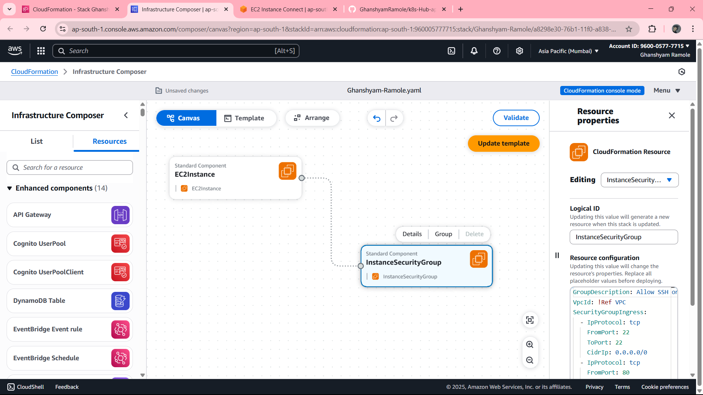

# Kubernetes-Hub Deployment using Infrastructure as Code (IaC)



## 📘 Project Overview

This project demonstrates deploying a **Kubernetes Hub (k8s-hub)** using a IaC and  shell script best practices.

## 🔧 Tools Used:

- **GitHub** – Source code management
- **AWS EKS** – Managed Kubernetes service
- **Docker** – Containerization platform
- **AWS CloudFormation** – Infrastructure as Code for provisioning EC2, VPC, and subnets
- **Shell Scripts** – Automate AWS CLI, EKSCTL, kubectl installation, and EKS cluster setup
  
---

## 🏗️ Infrastructure as Code Implementation

### Phase 1: CloudFormation Infrastructure

#### 1.1 Deploy Infrastructure Stack
```bash
# Deploy CloudFormation template
aws cloudformation create-stack \
    --stack-name k8s-hub-infrastructure \
    --template-body file://cloudformation-IAC/infrastructure-template.yml \
    --parameters ParameterKey=KeyName,ParameterValue=k8s-hub-key \
    --capabilities CAPABILITY_IAM

# Wait for stack completion
aws cloudformation wait stack-create-complete --stack-name k8s-hub-infrastructure
```

#### 1.2 Enhanced Infrastructure Template
```yaml
# cloudformation-IAC/infrastructure-template.yml
AWSTemplateFormatVersion: '2010-09-09'
Description: 'Complete infrastructure for Kubernetes Hub'

Parameters:
  KeyName:
    Type: AWS::EC2::KeyPair::KeyName
    Description: EC2 Key Pair for SSH access

Resources:
  # VPC Configuration
  VPC:
    Type: AWS::EC2::VPC
    Properties:
      CidrBlock: 10.0.0.0/16
      EnableDnsHostnames: true
      EnableDnsSupport: true
      Tags:
        - Key: Name
          Value: k8s-hub-vpc

  # Internet Gateway
  InternetGateway:
    Type: AWS::EC2::InternetGateway
    Properties:
      Tags:
        - Key: Name
          Value: k8s-hub-igw

  AttachGateway:
    Type: AWS::EC2::VPCGatewayAttachment
    Properties:
      VpcId: !Ref VPC
      InternetGatewayId: !Ref InternetGateway

  # Public Subnets
  PublicSubnet1:
    Type: AWS::EC2::Subnet
    Properties:
      VpcId: !Ref VPC
      CidrBlock: 10.0.1.0/24
      AvailabilityZone: !Select [0, !GetAZs '']
      MapPublicIpOnLaunch: true
      Tags:
        - Key: Name
          Value: k8s-hub-public-subnet-1

  PublicSubnet2:
    Type: AWS::EC2::Subnet
    Properties:
      VpcId: !Ref VPC
      CidrBlock: 10.0.2.0/24
      AvailabilityZone: !Select [1, !GetAZs '']
      MapPublicIpOnLaunch: true
      Tags:
        - Key: Name
          Value: k8s-hub-public-subnet-2

  # Route Table
  PublicRouteTable:
    Type: AWS::EC2::RouteTable
    Properties:
      VpcId: !Ref VPC
      Tags:
        - Key: Name
          Value: k8s-hub-public-rt

  PublicRoute:
    Type: AWS::EC2::Route
    DependsOn: AttachGateway
    Properties:
      RouteTableId: !Ref PublicRouteTable
      DestinationCidrBlock: 0.0.0.0/0
      GatewayId: !Ref InternetGateway

  # Security Group
  SecurityGroup:
    Type: AWS::EC2::SecurityGroup
    Properties:
      GroupDescription: Security group for K8s Hub
      VpcId: !Ref VPC
      SecurityGroupIngress:
        - IpProtocol: tcp
          FromPort: 22
          ToPort: 22
          CidrIp: 0.0.0.0/0
        - IpProtocol: tcp
          FromPort: 80
          ToPort: 80
          CidrIp: 0.0.0.0/0
        - IpProtocol: tcp
          FromPort: 443
          ToPort: 443
          CidrIp: 0.0.0.0/0
        - IpProtocol: tcp
          FromPort: 8080
          ToPort: 8080
          CidrIp: 0.0.0.0/0
        - IpProtocol: tcp
          FromPort: 9000
          ToPort: 9000
          CidrIp: 0.0.0.0/0

  # EC2 Instance
  EC2Instance:
    Type: AWS::EC2::Instance
    Properties:
      ImageId: ami-0c02fb55956c7d316
      InstanceType: t3.large
      KeyName: !Ref KeyName
      SecurityGroupIds:
        - !Ref SecurityGroup
      SubnetId: !Ref PublicSubnet1
      UserData:
        Fn::Base64: !Sub |
          #!/bin/bash
          apt-get update
          apt-get install -y git curl wget
      Tags:
        - Key: Name
          Value: k8s-hub-instance

Outputs:
  VPCId:
    Description: VPC ID
    Value: !Ref VPC
    Export:
      Name: !Sub "${AWS::StackName}-VPC-ID"
  
  InstanceId:
    Description: EC2 Instance ID
    Value: !Ref EC2Instance
    Export:
      Name: !Sub "${AWS::StackName}-Instance-ID"
```

### Phase 2: Automated Deployment Scripts

#### 2.1 Enhanced EKS Setup Script
```bash
#!/bin/bash
# enhanced-eks-setup.sh

set -e

# Configuration
CLUSTER_NAME="k8s-hub-cluster"
REGION="us-east-1"
NODE_GROUP_NAME="k8s-hub-nodes"

echo "🚀 Starting EKS cluster setup..."

# Install AWS CLI
install_aws_cli() {
    if ! command -v aws &> /dev/null; then
        echo "📦 Installing AWS CLI..."
        curl "https://awscli.amazonaws.com/awscli-exe-linux-x86_64.zip" -o "awscliv2.zip"
        sudo apt install unzip -y
        unzip awscliv2.zip
        sudo ./aws/install
        rm -rf aws awscliv2.zip
    else
        echo "✅ AWS CLI already installed"
    fi
}

# Install eksctl
install_eksctl() {
    if ! command -v eksctl &> /dev/null; then
        echo "📦 Installing eksctl..."
        curl --silent --location "https://github.com/weaveworks/eksctl/releases/latest/download/eksctl_$(uname -s)_amd64.tar.gz" | tar xz -C /tmp
        sudo mv /tmp/eksctl /usr/local/bin
    else
        echo "✅ eksctl already installed"
    fi
}

# Install kubectl
install_kubectl() {
    if ! command -v kubectl &> /dev/null; then
        echo "📦 Installing kubectl..."
        curl -LO "https://dl.k8s.io/release/v1.28.4/bin/linux/amd64/kubectl"
        sudo chmod +x kubectl
        sudo mv kubectl /usr/local/bin/
    else
        echo "✅ kubectl already installed"
    fi
}

# Configure AWS credentials
configure_aws() {
    echo "🔧 Configuring AWS credentials..."
    if ! aws sts get-caller-identity &>/dev/null; then
        echo "Please configure AWS CLI:"
        aws configure
    else
        echo "✅ AWS CLI already configured"
    fi
}

# Create EKS cluster
create_eks_cluster() {
    echo "🏗️ Creating EKS cluster (this may take 15-20 minutes)..."
    
    # Check if cluster already exists
    if aws eks describe-cluster --name $CLUSTER_NAME --region $REGION &>/dev/null; then
        echo "✅ Cluster $CLUSTER_NAME already exists"
    else
        eksctl create cluster \
            --name $CLUSTER_NAME \
            --region $REGION \
            --node-type t3.medium \
            --nodes 3 \
            --nodes-min 2 \
            --nodes-max 5 \
            --managed \
            --with-oidc \
            --ssh-access \
            --ssh-public-key k8s-hub-key \
            --tags Environment=dev,Project=k8s-hub
    fi
    
    # Update kubeconfig
    aws eks update-kubeconfig --region $REGION --name $CLUSTER_NAME
    
    # Verify cluster
    echo "🔍 Verifying cluster..."
    kubectl get nodes
    kubectl get pods --all-namespaces
}

# Install additional tools
install_additional_tools() {
    echo "📦 Installing additional tools..."
    
    # Install Helm
    if ! command -v helm &> /dev/null; then
        curl https://raw.githubusercontent.com/helm/helm/main/scripts/get-helm-3 | bash
    fi
    
    # Install ArgoCD CLI
    if ! command -v argocd &> /dev/null; then
        curl -sSL -o argocd-linux-amd64 https://github.com/argoproj/argo-cd/releases/latest/download/argocd-linux-amd64
        sudo install -m 555 argocd-linux-amd64 /usr/local/bin/argocd
        rm argocd-linux-amd64
    fi
}

# Main execution
main() {
    install_aws_cli
    install_eksctl
    install_kubectl
    configure_aws
    create_eks_cluster
    install_additional_tools
    
    echo ""
    echo "🎉 EKS cluster setup completed successfully!"
    echo ""
    echo "Cluster Information:"
    echo "  Name: $CLUSTER_NAME"
    echo "  Region: $REGION"
    echo "  Nodes: $(kubectl get nodes --no-headers | wc -l)"
    echo ""
    echo "Next steps:"
    echo "  1. Deploy your application: ./deploy.sh"
    echo "  2. Setup monitoring: ./setup-monitoring.sh"
    echo "  3. Configure ArgoCD: ./setup-argocd.sh"
    echo ""
    echo "To delete the cluster later:"
    echo "  eksctl delete cluster --name $CLUSTER_NAME --region $REGION"
}

main "$@"
```

#### 2.2 Enhanced Deployment Script
```bash
#!/bin/bash
# enhanced-deploy.sh

set -e

CLUSTER_NAME="k8s-hub-cluster"
REGION="us-east-1"
NAMESPACE="k8s-hub"

echo "🚀 Starting application deployment..."

# Verify cluster connection
verify_cluster() {
    echo "🔍 Verifying cluster connection..."
    if ! kubectl cluster-info &>/dev/null; then
        echo "❌ Cannot connect to cluster. Updating kubeconfig..."
        aws eks update-kubeconfig --region $REGION --name $CLUSTER_NAME
    fi
    echo "✅ Connected to cluster: $(kubectl config current-context)"
}

# Create namespace
create_namespace() {
    echo "📦 Creating namespace..."
    kubectl create namespace $NAMESPACE --dry-run=client -o yaml | kubectl apply -f -
}

# Deploy application
deploy_application() {
    echo "🚀 Deploying Kubernetes Hub application..."
    
    # Apply Kubernetes manifests
    kubectl apply -f K8s-files/ -n $NAMESPACE
    
    # Wait for deployment to be ready
    echo "⏳ Waiting for deployment to be ready..."
    kubectl rollout status deployment/k8s-hub-deployment -n $NAMESPACE --timeout=300s
    
    # Get service information
    echo "📋 Service Information:"
    kubectl get svc -n $NAMESPACE
    
    # Get external IP
    echo "🌐 Getting external access information..."
    EXTERNAL_IP=$(kubectl get svc k8s-hub-service -n $NAMESPACE -o jsonpath='{.status.loadBalancer.ingress[0].hostname}')
    
    if [ -n "$EXTERNAL_IP" ]; then
        echo "✅ Application deployed successfully!"
        echo "🌐 Access your application at: http://$EXTERNAL_IP:3000"
    else
        echo "⏳ LoadBalancer is still provisioning. Check again in a few minutes:"
        echo "kubectl get svc -n $NAMESPACE"
    fi
}

# Setup ingress (optional)
setup_ingress() {
    echo "🔧 Setting up ingress controller..."
    
    # Install AWS Load Balancer Controller
    helm repo add eks https://aws.github.io/eks-charts
    helm repo update
    
    helm install aws-load-balancer-controller eks/aws-load-balancer-controller \
        -n kube-system \
        --set clusterName=$CLUSTER_NAME \
        --set serviceAccount.create=false \
        --set serviceAccount.name=aws-load-balancer-controller
}

# Main execution
main() {
    verify_cluster
    create_namespace
    deploy_application
    
    echo ""
    echo "🎉 Deployment completed successfully!"
    echo ""
    echo "Useful commands:"
    echo "  kubectl get pods -n $NAMESPACE"
    echo "  kubectl get svc -n $NAMESPACE"
    echo "  kubectl logs -f deployment/k8s-hub-deployment -n $NAMESPACE"
    echo "  kubectl describe svc k8s-hub-service -n $NAMESPACE"
}

main "$@"
```

---

## 📊 Monitoring & Observability

### Setup Prometheus & Grafana
```bash
#!/bin/bash
# setup-monitoring.sh

# Add Helm repositories
helm repo add prometheus-community https://prometheus-community.github.io/helm-charts
helm repo add grafana https://grafana.github.io/helm-charts
helm repo update

# Install Prometheus
helm install prometheus prometheus-community/kube-prometheus-stack \
    --namespace monitoring \
    --create-namespace \
    --set grafana.adminPassword=admin123

# Get Grafana URL
kubectl get svc -n monitoring prometheus-grafana
```

---

## 🧹 Cleanup & Maintenance

### Cleanup Script
```bash
#!/bin/bash
# cleanup.sh

CLUSTER_NAME="k8s-hub-cluster"
REGION="us-east-1"

echo "🧹 Starting cleanup process..."

# Delete Kubernetes resources
kubectl delete namespace k8s-hub --ignore-not-found=true
kubectl delete namespace monitoring --ignore-not-found=true

# Delete EKS cluster
eksctl delete cluster --name $CLUSTER_NAME --region $REGION

# Delete CloudFormation stack
aws cloudformation delete-stack --stack-name k8s-hub-infrastructure

echo "✅ Cleanup completed!"
```

---

## 🎯 Best Practices & Tips

### Security Best Practices
- Use IAM roles instead of access keys where possible
- Enable VPC Flow Logs for network monitoring
- Implement Pod Security Standards
- Use AWS Secrets Manager for sensitive data
- Enable audit logging for EKS

### Cost Optimization
- Use Spot instances for non-production workloads
- Implement Horizontal Pod Autoscaler (HPA)
- Use Cluster Autoscaler for node scaling
- Monitor resource usage with AWS Cost Explorer

### Troubleshooting
```bash
# Common debugging commands
kubectl get events --sort-by=.metadata.creationTimestamp
kubectl describe pod <pod-name>
kubectl logs -f <pod-name>
aws eks describe-cluster --name <cluster-name>
```

---

## 📞 Support & Resources

- **AWS EKS Documentation**: https://docs.aws.amazon.com/eks/
- **Kubernetes Documentation**: https://kubernetes.io/docs/
- **Jenkins Documentation**: https://www.jenkins.io/doc/
- **ArgoCD Documentation**: https://argo-cd.readthedocs.io/

